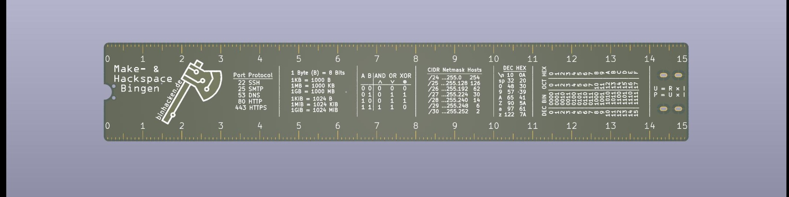
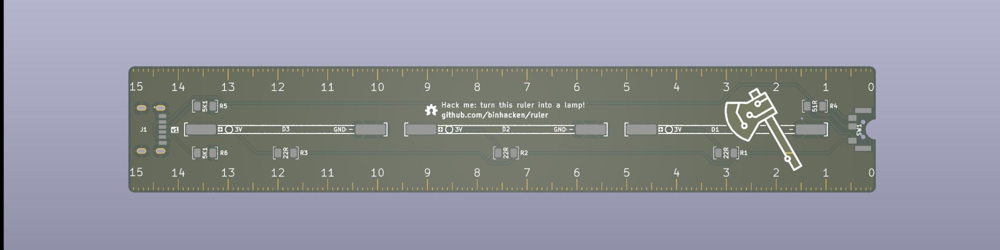
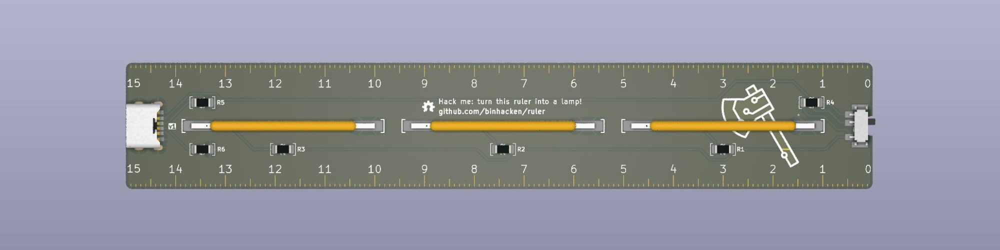

# PCB Ruler "Bright Start"

Ein Platinen Lineal für die Ersti-Tüte der TH Bingen 2025. 
Mit kleinen cheat-sheets für die Informatik Studierenden.

Kann zu einer LED Lampe umgebaut werden. 

## Components

- PCB (Das Lineal selbst)
- 3x LED Filament 3V 38mm (D1,D2,D3)
- 1x USB-C Buchse 6-Pin (J1)
- 6x Wiederstände 1206
    - 3x 22Ω (R1,R2,R3)
    - 1x 51Ω (R4)
    - 2x 5.1KΩ (R5,R6)
- 1x 7pin toggle switch (SW1)

Für R1,R2,R3 und R4 können auch höhere Widerstandswerte verwendet werden, um die Helligkeit zu verringern. 
R5 und R6 sind für USB und sollten 5.1KΩ haben (im Notfall gehen auch 4.7KΩ – 5.6KΩ). 

Der Schalter (SW1) ist dafür da zwischen 2 Helligkeitsstufen zu wählen. 
Wer stattdessen einen an/aus Schalter bevorzugt, kann R4 weglassen. 

Wir haben die passenden Bauteile und Werkzeug parat, komm gerne vorbei! https://binhacken.de/ 

## Placement

Es empfiehlt sich, die Bauteile wie folgt auf der Platine zu platzieren:

1. Die USB-C Buchse (**J1**) und der 7pin toggle switch (**SW1**). 
2. Die Widerstände (R1-R6)
3. Die LEDs (D1-D3)

Wer wenig Erfahrung mit Löten hat, kann auch gerne mit einem der Widerstände (R1-R6) beginnen, da diese in der Regel einfacher zu löten sind. Auch wenn die USB-C Buchse und der Schalter etwas anspruchsvoller zu löten sind, sollten sie nicht zuletzt platziert werden, da die kleinen Pads sonst schwerer zugänglich sind.

Eine Interaktive Ansicht der Platine gibt es hier: https://htmlpreview.github.io/?https://github.com/BinHacken/ruler/blob/main/bom/ibom.html

## Ordering

Folgende Optionen haben wir bei JLC gewählt:

* Deburring/Edge rounding: Yes
* PCB Thickness: 1mm
* Surface Finish: Leadfree HASL
* Mark on PCB: Remove Mark